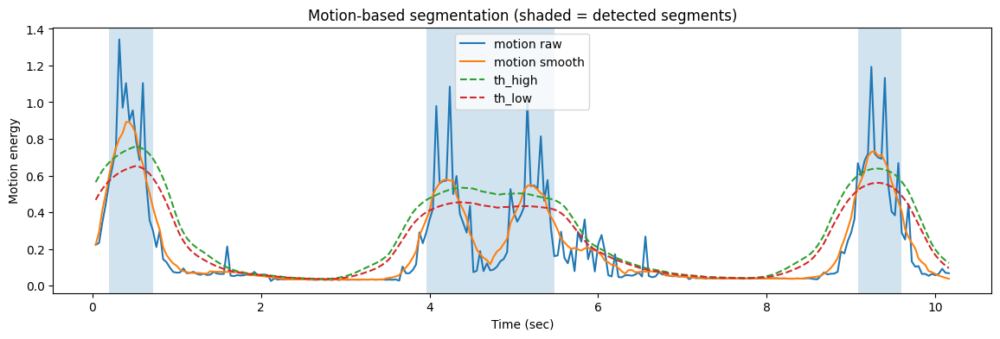

<div align="center">


<p>
  <a href="https://pypi.org/project/signlang-segmenter/"></a>
  
  <a href="https://github.com/24-mohamedyehia/signlang-segmenter/blob/main/LICENSE"></a>
</p>

# signlang-segmenter
A Python library for segmenting and clipping sign language videos into meaningful units. It provides dual capabilities: intelligent segmentation based on motion analysis, and fast, precise video clipping based on timestamp annotations. Includes tools for visualizing motion curves and exporting segmented video clips.

</div>

<br/>
<br/>

## Optical Flow


## Installation

### Option 1: Install the library to use it

```bash
pip install signlang-segmenter
```

Or install it directly from GitHub:

```bash
python -m pip install "git+https://github.com/24-mohamedyehia/signlang-segmenter.git"
```

### Option 2: Install the project for development

If you want to modify the code and contribute, use an isolated environment and editable install:

1. Install Miniconda if needed.
2. Run:

```bash
git clone https://github.com/24-mohamedyehia/signlang-segmenter.git
cd signlang-segmenter
conda create -n signlang-segmenter python=3.11 -y
conda activate signlang-segmenter
python -m pip install --upgrade pip
python -m pip install -e ".[dev]"

```

## Quick Import Check

```python
import signlang_segmenter
import signlang_segmenter.video
import signlang_segmenter.pose
```

## Timecode Clipping API

Fast snippet extraction based on manual annotation tools or generated timecodes:

```python
from signlang_segmenter.video import split_video_with_timecode

output = split_video_with_timecode(
    annotations_dir="./annotations",
    videos_dir="./videos",
    output_dir="./clips",
    csv_file="./annotations.csv",
)
```

## Motion Segmentation API

```python
from signlang_segmenter.video import VideoSegmenter, SegmentExporter

segmenter = VideoSegmenter(
	roi_mode="full",
	smooth_window=11,
	min_len_sec=0.30,
	merge_gap_sec=0.45,
	pad_before_frames=10,
	pad_after_frames=12,
)

segments, info = segmenter.segment(VIDEO_PATH)
print(f"Found {len(segments)} segments: {segments}")

exporter = SegmentExporter(out_dir="../output/segments_out")
exporter.export(VIDEO_PATH, segments)
```

## Visualization

```python
from signlang_segmenter.video import plot_motion_segments

plot_motion_segments(segments, info)
```

The plot includes:

- motion raw curve
- motion smooth curve
- adaptive high/low thresholds
- shaded spans for detected segments

The `info` dict returned by `VideoSegmenter.segment` must include:

- `motion_raw`
- `motion_smooth`
- `fps`
- `frame_idx`
- `th_high_arr`
- `th_low_arr`
